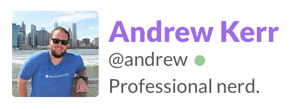

footer: Git, GitHub, and Devpost
slidenumbers: true

# Code Collaboration and Submission

^ aka

---

# Git, GitHub, and Devpost

---

## whoami

---

## whoami

- Fifth year Software Engineering @ UF

---

## whoami

- Fifth year Software Engineering @ UF
- Officer of the UF Student InfoSec Team

---

## whoami

- Fifth year Software Engineering @ UF
- Officer of the UF Student InfoSec Team
- Full stack web developer

^ Primarily on Rails; loved security, but liked dev

---

## whoami

- Fifth year Software Engineering @ UF
- Officer of the UF Student InfoSec Team
- Full stack web developer
- Currently web eng lead at Quottly

---

## whoami

- Fifth year Software Engineering @ UF
- Officer of the UF Student InfoSec Team
- Full stack web developer
- Former security intern at Tumblr

^ Turns out you can do both!

^ Worked on TFA enhancements, Content-Security-Policy, patching vulnerabilities, and more!

---

## whoami

- Fifth year Software Engineering @ UF
- Officer of the UF Student InfoSec Team
- Full stack web developer
- Former security intern at Tumblr
- Former intern at BlockScore

^ Security specifics - audit for auth bypass, TFA, rate limiting

---

## whoami

- Fifth year Software Engineering @ UF
- Officer of the UF Student InfoSec Team
- Full stack web developer
- Former security intern at Tumblr
- Former intern at BlockScore
- Reach me @andrew on Slack

^ hmu if you have questions or w/e

