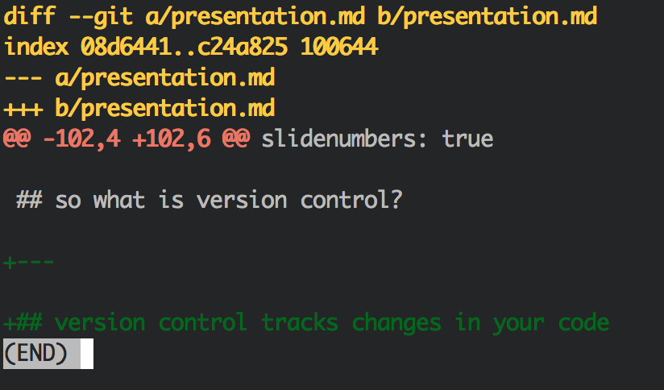
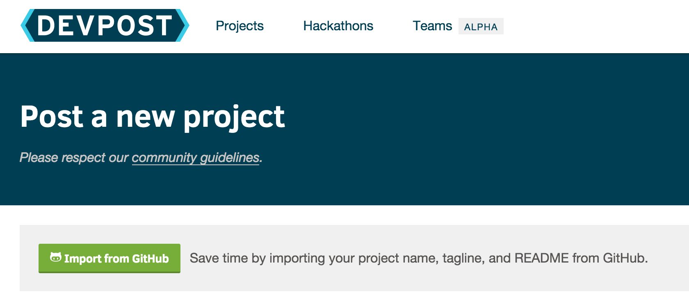
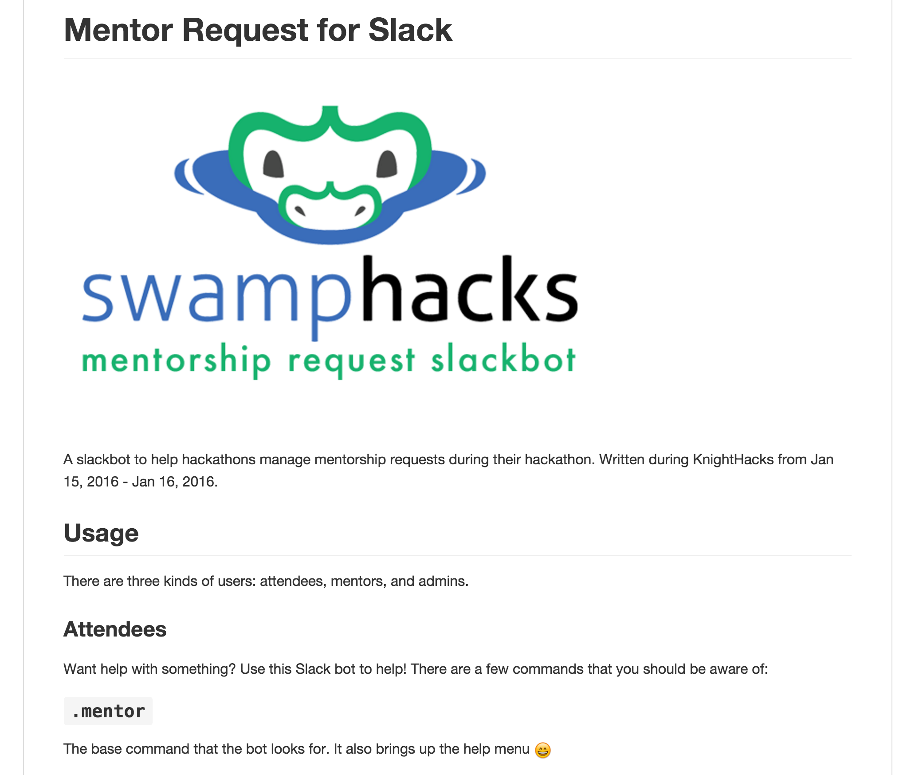

footer: Git, GitHub, and Devpost
slidenumbers: true

# Code Collaboration and Submission

^ aka

---

# Git, GitHub, and Devpost
## Andrew Kerr <me@andrewjkerr.com>

^ please download git!!!!!!

---

## whoami

---

## whoami

- Fifth year Software Engineering @ UF

---

## whoami

- Fifth year Software Engineering @ UF
- Officer of the UF Student InfoSec Team

---

## whoami

- Fifth year Software Engineering @ UF
- Officer of the UF Student InfoSec Team
- Full stack web developer

^ Primarily on Rails; loved security, but liked dev

---

## whoami

- Fifth year Software Engineering @ UF
- Officer of the UF Student InfoSec Team
- Full stack web developer
- Currently web eng lead at Quottly

---

## whoami

- Fifth year Software Engineering @ UF
- Officer of the UF Student InfoSec Team
- Full stack web developer
- Currently web eng lead at Quottly
- Former security intern at Tumblr

^ Turns out you can do both!

^ Worked on TFA enhancements, Content-Security-Policy, patching vulnerabilities, and more!

---

## whoami

- Fifth year Software Engineering @ UF
- Officer of the UF Student InfoSec Team
- Full stack web developer
- Currently web eng lead at Quottly
- Former security intern at Tumblr
- Former intern at BlockScore

^ Security specifics - audit for auth bypass, TFA, rate limiting

---

## whoami

- Fifth year Software Engineering @ UF
- Officer of the UF Student InfoSec Team
- Full stack web developer
- Currently web eng lead at Quottly
- Former security intern at Tumblr
- Former intern at BlockScore
- Reach me @andrew on Slack

^ hmu if you have questions or w/e

---

## Git

---

## At it's core, git is version control

---

## What is version control?

---

## Version control tracks changes in your code

^ what does this look like?

---

^ green code is what was added

---

## Why is this useful?

---

## Collaboration

^ allows teams to work on code
shows who worked on what
and also allows for changes to be tracked

---

## How does this work?

---

## How does this work?

1. Download code from remote server

---

## How does this work?

1. Download code from remote server
2. Make your changes

---

## How does this work?

1. Download code from remote server
2. Make your changes
3. Upload code to remote server

---

## How does this work?

1. Download code from remote server
2. Make your changes
3. Upload code to remote server
4. Version control figures out what has changed and applies those changes to the codebase

^ any questions?

---

## Cool, so let's talk about git

---

## Git Basics

---

## Open up a terminal!

^ we're going to go over the workflow

---

## 1. Make a new directory

^ on unix, `mkdir`

---

## 2. `git init`

^ initializes a new git repository (repo)
repo - A directory where Git has been initialized to start version controlling your files.

---

## 3. `git status`

^ see the status of the project

---

## 4. Make a file

^ on unix, `touch file.txt`

---

## 5. `git status`

^ you'll see that there's an untracked file

---

## 6. `git add .`

^ add the ALL of the changes to the staging area

---

## 6. `git add .`

- "staged files" are files that are ready to be committed to git
- "unstaged files" are files that have changes that have not been prepared to be committed

---

## can also use `git add [filename]` for individual files

---

## 7. `git status`

^ you'll see that there are now changes to be committed! Woohoo!

---

## 8. `git commit -m 'Summary of changes'`

^ actually store our changes in the repository

---

## 9. `git log`

^ lists our changes

---

## Any questions?

^ basics for local

---

## Git Branches

^ branches are awesome

---

## Git Branches

- A "copy" of code that developers can work on independently of the main code base

---

## Git Branches

- A "copy" of code that developers can work on independently of the main code base
- The main code base is normally "master"
- Once the developer is done, can "merge" it back into master

^ to do this we use...

---

## `git branch [branchname]`

^ creates a new branch

---

## Once we have a new branch, we follow the git flow

^ add new file, commit change

---

## We have new code on a branch, how do we merge back?

---

## `git checkout master`

^ switch to master

---

## `git merge [branchname]`

^ don't need to commit - already good!

---

## Using branches allows for multiple developers to work on the same code base

^ branches allow for multiple "copies" of the code to exist with new changes

---

## Any questions?

---

## Git Remotes

^ we talked about a remote server earlier...

---

## Git Remotes

- A remote server for your git repository!

---

## Git Remotes

- A remote server for your git repository!
- This is where GitHub comes in...

---

## GitHub

^ What is GitHub?

---

> Powerful collaboration, code review, and code management for
open source and private projects.

---

## Helps put a GUI on top of git!

^ plus a few features such as issue tracking and pull requests ("requests to merge")

---

## Sign up for GitHub at github.com

---

## Once signed up, create a repository

---

## Get the remote `ssh` url

---

## Back to the command line...

---

## `git remote add origin [url]`

^ Adds an "origin" remote
Origin is just standard practice

---

## `git remote -v`

^ list the remotes

---

## So, how do we get code on our remote?

---

## `git push`

^ "push" the code to the remote server

---

## Awesome! Now we've got code on GitHub

---

## Once a teammate pushes changes, make sure to use `git pull` to download the new changes

---

## Any questions?

^ So why use GitHub?

---

## GitHub + Devpost

---

^ see that import from GitHub button?!

---

## Preparing your GitHub repo for submission

---

## 1. Create a README.md file

^ Plain text file that describes your project in detail

---

## Example: https://github.com/andrewjkerr/hackathon-mentor-request-slackbot

^ From KnightHacks...

---

---

## 2. Set the description

---

> "A slackbot to help manage mentorship requests for hackathons (aka SwampHacks)."

^ _SHORT_ description

---

## Anddd that's it! Pretty easy, eh?

---

## To review

---

## To review 

1. `git pull`

^ pull new code from remote server

---

## To review 

1. `git pull`
2. `git checkout -b branch`

^ checks out a new branch

---

## To review 

1. `git pull`
2. `git checkout -b branch`
3. Make changes

---

## To review 

1. `git pull`
2. `git checkout -b branch`
3. Make changes
4. `git add .`

^ stage the changes

---

## To review 

1. `git pull`
2. `git checkout -b branch`
3. Make changes
4. `git add .`
5. `git commit -m 'commit summary'`

^ commit the changes

---

## To review 

1. `git pull`
2. `git checkout -b branch`
3. Make changes
4. `git add .`
5. `git commit -m 'commit summary'`
6. `git checkout master`

^ once you're done, checkout master

---

## To review (continued...)

7. `git pull`

^ make sure master is up to date

---

## To review (continued...)

7. `git pull`
8. `git merge branch`

^ merge the branch

---

## To review (continued...)

7. `git pull`
8. `git merge branch`
9. `git push`

^ push the new code

---

## To review (continued...)

7. `git pull`
8. `git merge branch`
9. `git push`
10. Do it all again!

---

## Git and GitHub can help teams work more efficiently on code

---

## (And it doesn't hurt that GitHub works well with Devpost)

---

## Any questions?

---

## Slides available at talk.andrewjkerr.com
